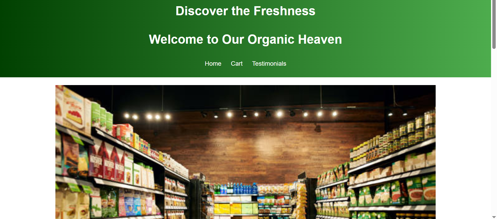
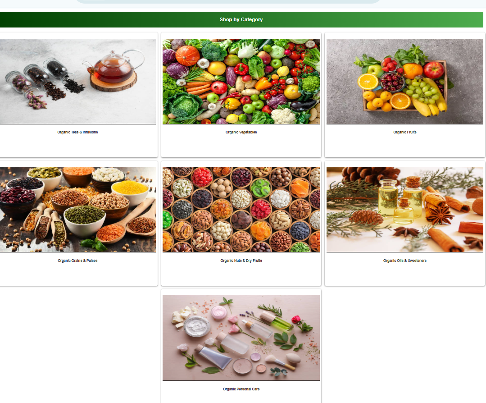
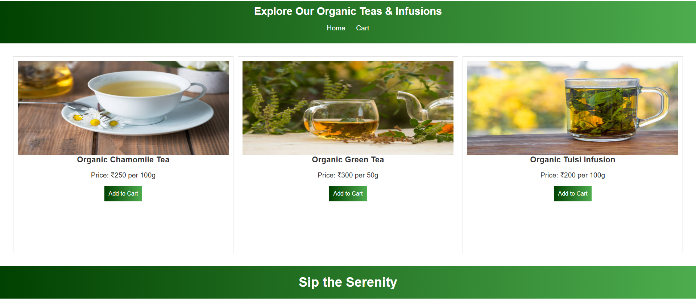
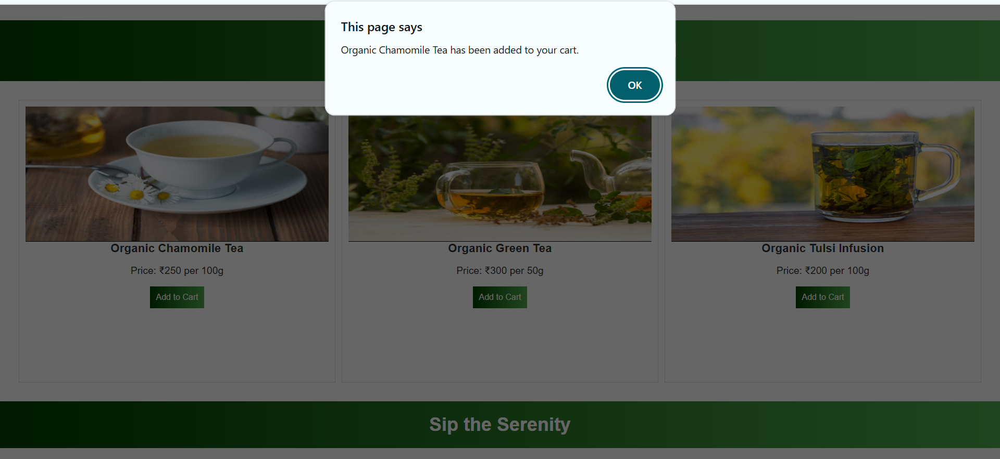
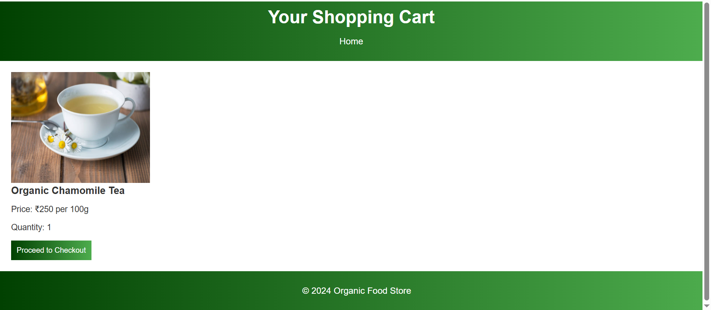
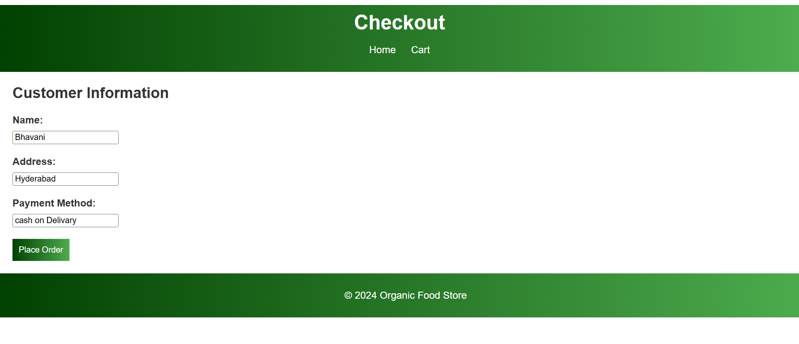
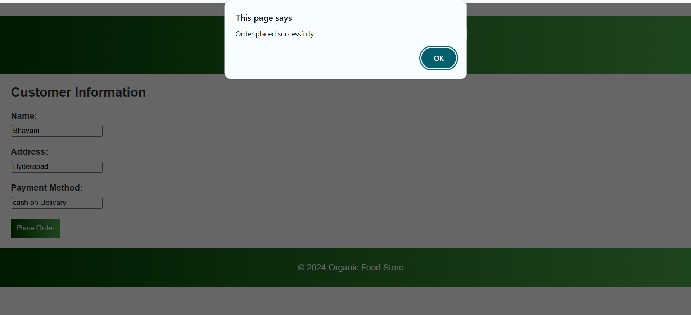

🌿 Organic E-Commerce Store

This is a front-end e-commerce website project designed to showcase a wide range of organic products using **HTML, CSS, and JavaScript**. It simulates a clean, user-friendly shopping experience focused on healthy and natural living.

🛍️ Project Overview

The Organic E-Commerce Store is a static website that displays various categories of organic products. It is suitable for practice and learning purposes for front-end web development.

🧺 Product Categories Included

- Organic Teas & Infusions  
- Organic Personal Care  
- Organic Vegetables  
- Organic Fruits  
- Organic Grains & Pulses  
- Organic Nuts & Dry Fruits  
- Organic Oils & Sweeteners  

✨ Features

- Responsive website layout  
- Category-wise product listings  
- Product cards with image, name, and price (in ₹)  
- Navigation bar with links to product sections  
- Simple and clean user interface  
- Home, About, Contact sections included

🛠️ Technologies Used

- HTML5 – For structure  
- CSS3 – For styling and responsiveness  
- JavaScript – For interactivity (sliders, navigation, etc.)

📸 Screenshots

 

 
 
 
 
 

